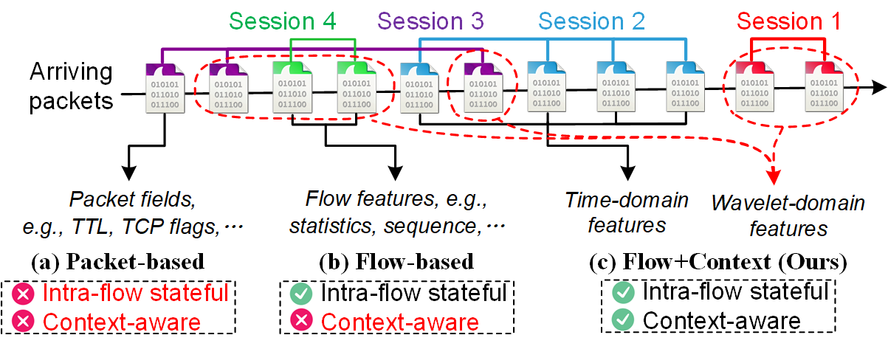

[](https://doi.org/10.5281/zenodo.14699122)

# Towards Context-Aware Traffic Classification via Time-Wavelet Fusion Network



## Introduction

TrafficScope is a time-wavelet fusion network based on Transformer to enhance the performance of encrypted traffic classification. Specifically, in addition to using intra-flow semantics, TrafficScope also extracts contextual information to construct more comprehensive representations. Moreover, to cope with the non-stationary and dynamic contextual traffic, we employ wavelet transform to extract invariant features. For feature fusion, the cross-attention mechanism is adopted to inline combine temporal and wavelet-domain features. 


## Requirements

```bash
pip install numpy
pip install pandas
pip install matplotlib
pip install sklearn
pip install torch
pip install d2l==0.17.0
```

## How to Use

- Split: Use ./SplitCap.exe to divide PCAP traffic into 5-tuple sessions.
- Dataset: Use ./dataset_gen.py to generate the required temporal features and wavelet-domain features. 

```bash
python3 -u dataset_gen.py --pcaps_path=/XXX/demo_data/Benign --class_name=Benign --sessions_dir=/XXX/sessions --data_path=/XXX/gene_data/Benign.npy --wave_name='cgau8'
```
```bash
python3 -u dataset_gen.py --pcaps_path=/XXX/demo_data/Attack --class_name=Attack --sessions_dir=/XXX/sessions --data_path=/XXX/gene_data/Attack.npy --wave_name='cgau8'
```
```bash
python3 -u dataset_gen.py --contextual --pcaps_path=Benign.pcap --session_pcaps_used=/XXX/gene_data/Benign_temporal_session_used.json --wave_name=cgau8 --data_path=/XXX/gene_data/Benign.npy
```
```bash
python3 -u dataset_gen.py --contextual --pcaps_path=Attack.pcap --session_pcaps_used=/XXX/gene_data/Attack_temporal_session_used.json --wave_name=cgau8 --data_path=/XXX/gene_data/Attack.npy
```

- Model: The ./models.py file contains three components of the model, i.e., the Temporal Encoder, the Contextual Encoder, and the Fusion Encoder.
- Train and Test: The ./train_test.py file corresponds to model training and testing. 

```bash
python3 -u train_test.py --data_dir=/XXX/gene_data/ --use_temporal --use_contextual --is_train --is_test --num_classes=2 --model_path=/XXX/model/trafficscope.pth --result_path=/XXX/result/trafficscope.npy
```


### References
- [New Directions in Automated Traffic Analysis](https://doi.org/10.1145/3460120.3484758), 	Jordan Holland, Paul Schmitt, Nick Feamster, Prateek Mittal - CCS 2021
- [FS-Net: A Flow Sequence Network For Encrypted Traffic Classification](https://ieeexplore.ieee.org/document/8737507/), Chang Liu, Longtao He, Gang Xiong, Zigang Cao, Zhen Li - INFOCOM 2019
- [FlowLens: Enabling Efficient Flow Classification for ML-based Network Security Applications](https://www.ndss-symposium.org/ndss-paper/flowlens-enabling-efficient-flow-classification-for-ml-based-network-security-applications/), Diogo Barradas, Nuno Santos, Luís Rodrigues, Salvatore Signorello, Fernando M. V. Ramos, André Madeira - NDSS 2021
- [ET-BERT: A Contextualized Datagram Representation with Pre-training Transformers for Encrypted Traffic Classification](https://dl.acm.org/doi/10.1145/3485447.3512217), Xinjie Lin, Gang Xiong, Gaopeng Gou, Zhen Li, Junzheng Shi, Jing Yu - WWW 2022
- [Realtime Robust Malicious Traffic Detection via Frequency Domain Analysis](https://dl.acm.org/doi/10.1145/3460120.3484585), Chuanpu Fu, Qi Li, Meng Shen, Ke Xu - CCS 2021
- [Detecting Unknown Encrypted Malicious Traffic in Real Time via Flow Interaction Graph Analysis](https://www.ndss-symposium.org/ndss-paper/detecting-unknown-encrypted-malicious-traffic-in-real-time-via-flow-interaction-graph-analysis/), Chuanpu Fu, Qi Li, Ke Xu - NDSS 2023
- [FlowPrint: Semi-Supervised Mobile-App Fingerprinting on Encrypted Network Traffic](https://www.ndss-symposium.org/ndss-paper/flowprint-semi-supervised-mobile-app-fingerprinting-on-encrypted-network-traffic/), Thijs van Ede, Riccardo Bortolameotti, Andrea Continella, Jingjing Ren, Daniel J. Dubois, Martina Lindorfer, David Choffnes, Maarten van Steen, Andreas Peter - NDSS 2020
